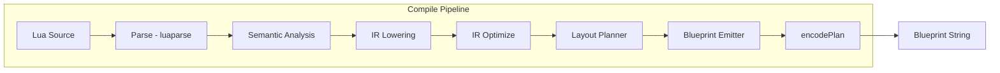

# LuaTorio Design Spec

**Date:** 2026-07-22  
**Status:** Approved  
**Repo:** LuaTorio

## Summary

LuaTorio is a TypeScript compiler that translates a restricted subset of real Lua into Factorio 2.0+ circuit network blueprints. Users write Lua describing combinational logic; the compiler emits a pasteable blueprint string.

**v1** covers expression-only programs (arithmetic, comparisons, `if`/`else` expressions) with explicit `input()` / `output()` annotations. The internal IR and pipeline are designed to grow toward a full structured Lua subset (loops, functions, recursion, tables, entity placement).

## Goals

- Compile real Lua syntax (parsed with `luaparse`) into working Factorio circuit blueprints
- Ship as an npm library (`@luatorio/core`) and CLI (`luatorio`) in v1
- Design the IR and pipeline for incremental language expansion without rewrites
- Target Factorio 2.0+ (multi-condition deciders, current blueprint schema)

## Non-Goals (v1)

- Sequential logic (`while`, reassignment, `tick()`)
- User-defined functions
- Tables and multi-signal bundles
- Entity placement (`place()`)
- Automatic red/green wire allocation
- Web playground (planned post-v1)
- Factorio 1.1 compatibility

## Architecture



### Monorepo Layout

```
luatorio/
├── packages/
│   ├── core/          # compile(source, options) → CompileResult
│   └── cli/           # `luatorio compile program.lua`
├── package.json       # npm workspaces
└── docs/
```

### Public API (`@luatorio/core`)

```typescript
interface CompileOptions {
  name?: string;
  optimize?: boolean;   // default true
  json?: boolean;       // return raw JSON instead of encoded string
}

interface CompileResult {
  blueprint: string;    // or Blueprint JSON when json: true
  stats: { combinators: number; wires: number };
  warnings: string[];
}

function compile(source: string, options?: CompileOptions): CompileResult;
```

### Dependencies

| Package | Purpose |
|---|---|
| `luaparse` | Lua AST parsing |
| `@jensforstmann/factorio-blueprint-tools` | Typed blueprint encode/decode for Factorio 2.0 |

### Approach

Use a **full Lua parser with semantic gating** (not a custom grammar). Unsupported constructs are rejected at semantic analysis with clear, actionable errors. Expressions lower to a circuit-oriented IR; layout and emission are IR-driven and stable across language versions.

Rejected alternatives:
- **Custom grammar parser** — diverges from real Lua; poor migration path
- **Direct AST-to-combinator lowering** — blocks the v2+ roadmap; layout logic becomes entangled

## v1 Language Specification

v1 programs are a **sequence of statements** in a single scope (no user-defined functions).

### Example

```lua
-- Clamp signal-A to [0, 100], output on signal-B
local raw = input("signal-A")
local clamped = raw < 0 and 0 or (raw > 100 and 100 or raw)
output("signal-B", clamped)
```

### Allowed Constructs

| Construct | v1 | Notes |
|---|---|---|
| `local x = <expr>` | yes | Single assignment per variable |
| `input("signal-name")` | yes | Built-in; creates input port |
| `output("signal-name", expr)` | yes | Built-in; creates output port |
| Arithmetic `+ - * * / %` | yes | Maps to arithmetic combinators |
| Comparisons `< > <= >= == ~=` | yes | Maps to decider (outputs 0/1) |
| `if a then b else c` | yes | Expression form; mux via decider |
| `a and b or c` | yes | Standard Lua ternary idiom |
| Integer literals | yes | Constant combinators |
| Reassignment `x = ...` | no | v2 with memory cells |
| `while`, `for` | no | v2+ |
| `function` | no | v3 |
| Tables `{ }` | no | v4 |
| Strings (except in `input`/`output`) | no | v1 is numeric signals only |

### Signal Naming

Strings in `input()` / `output()` map to Factorio signals:
- Virtual: `"signal-A"` through `"signal-Z"`
- Items/fluid: `"iron-plate"`, `"water"`, etc.

A future type checker may validate names against a signal registry.

### Semantic Rules

1. Every `local` must be initialized with an allowed expression
2. Variables are single-assignment (SSA-like) in v1 — redeclaring or reassigning is an error
3. At least one `output()` call is required
4. `input()` and `output()` must use string literals (not variables)
5. Unsupported AST node types produce errors naming the construct and the planned version

## Intermediate Representation

The IR is a **signal-value DAG** in v1. It grows into a **control-flow graph** when loops and `tick()` arrive in v2.

```typescript
// v1 nodes
type IRNode =
  | { kind: 'literal'; value: number }
  | { kind: 'input';  signal: SignalName; port: PortId }
  | { kind: 'binop';  op: ArithOp; left: IRNode; right: IRNode }
  | { kind: 'cmp';    op: CmpOp;   left: IRNode; right: IRNode }
  | { kind: 'select'; cond: IRNode; then: IRNode; else: IRNode };

// v2+ additions (planned, not implemented in v1)
// | { kind: 'memory'; cell: CellId }
// | { kind: 'phi'; inputs: Array<{ block: BlockId; value: IRNode }> }
// | { kind: 'call'; fn: FnRef; args: IRNode[] }
```

### v1 Optimizations

- **Constant folding** — `2 + 3` → `5` with no combinator
- **Common subexpression elimination** — share combinators when the same subexpression is used multiple times
- **Dead code elimination** — remove unused `local` bindings

The IR is the stable contract between parsing and blueprint emission. Layout planner and emitter remain unchanged as the language grows.

## Combinator Lowering

| IR node | Combinator | Configuration |
|---|---|---|
| `literal(n)` | constant-combinator | outputs temp signal with value n |
| `input(sig)` | constant-combinator | placeholder at input edge; wired from external network |
| `binop(+, a, b)` | arithmetic-combinator | A + B → temp signal |
| `binop(-, a, b)` | arithmetic-combinator | A − B → temp signal |
| `binop(*, a, b)` | arithmetic-combinator | A × B → temp signal |
| `binop(/, a, b)` | arithmetic-combinator | A ÷ B → temp signal |
| `binop(%, a, b)` | arithmetic-combinator | A % B → temp signal |
| `cmp(>, a, b)` | decider-combinator | if A > B output 1 else 0 |
| `select(c, t, e)` | decider-combinator | if C > 0 output T else E (mux) |
| `output(sig, val)` | constant-combinator | reads value signal, exposes as named output |

Temp signals use internal names (`__t1`, `__t2`, …) and are not exposed to the user.

## Layout and Wiring

### Layout (v1)

- Place combinators in a left-to-right topological grid, 2 tiles apart
- Inputs on the left edge, outputs on the right
- All internal wiring on **green wire** in v1
- Red/green wire allocation deferred to the bundles phase (v4 roadmap)

### Wiring

- Each IR node receives an `entity_number` and a temp signal name
- Wires use Factorio 2.0 `wires` array format: `[src_entity, src_connector, dst_entity, dst_connector]`
- Wire connector IDs follow Factorio 2.0 `defines.wire_connector_id`

## CLI

```bash
npx luatorio compile program.lua              # blueprint string to stdout
npx luatorio compile program.lua -o out.txt   # save to file
npx luatorio compile program.lua --json       # raw JSON for debugging
npx luatorio compile program.lua --name "My Circuit"
```

## Error Handling

| Error type | Source | Example message |
|---|---|---|
| Parse error | `luaparse` | `syntax error at line 3: unexpected symbol` |
| Unsupported construct | Semantic analysis | `unsupported construct: while loop (planned for v2)` |
| Reassignment | Semantic analysis | `variable 'x' is already defined; reassignment planned for v2` |
| Missing output | Semantic analysis | `program must contain at least one output() call` |
| Non-literal signal | Semantic analysis | `input() requires a string literal signal name` |

All errors include source line/column where applicable.

## Testing Strategy

| Layer | What | How |
|---|---|---|
| Unit | IR lowering | Lua snippet → expected IR JSON snapshot |
| Unit | Optimizations | IR before/after optimization snapshots |
| Integration | Full compile | Known program → decode blueprint → assert entity count, combinator settings, wire connectivity |
| Golden | End-to-end | Known programs → snapshot of blueprint JSON |

Tests run with Vitest. Golden snapshots are reviewed on intentional output changes.

## Roadmap

| Phase | Features | IR changes | Issues |
|---|---|---|---|
| **v1** | Expressions, `input()` / `output()` | Signal DAG | Done |
| **v2** | `while`, reassignment, `tick()`; leftover: `elseif` / nested if | Memory cells, tick scheduler | Done; [#65](https://github.com/lexwebb/LuaTorio/issues/65) |
| **v3** | Functions (no recursion) | `call` nodes, inlining | [#67](https://github.com/lexwebb/LuaTorio/issues/67), [#68](https://github.com/lexwebb/LuaTorio/issues/68) |
| **v4** | Recursion, tables, `each` bundles | Stack simulation, multi-signal wires | Bags [#66](https://github.com/lexwebb/LuaTorio/issues/66); tables [#69](https://github.com/lexwebb/LuaTorio/issues/69)/[#70](https://github.com/lexwebb/LuaTorio/issues/70); recursion [#71](https://github.com/lexwebb/LuaTorio/issues/71) |
| **v5** | Entity placement (`place()`) | Spatial IR, entity nodes | [#72](https://github.com/lexwebb/LuaTorio/issues/72), [#73](https://github.com/lexwebb/LuaTorio/issues/73) |
| **Web** | Browser playground | WASM or pure TS bundle of `@luatorio/core` | #14–#17, #42–#43 done |

See also `2026-07-23-next-language-ir-slices.md` for ordering vs cookbook bag emit (#57–#63).

## Project Management

Track work via **GitHub Projects** with milestones per phase. See project setup recommendations in the implementation plan.
